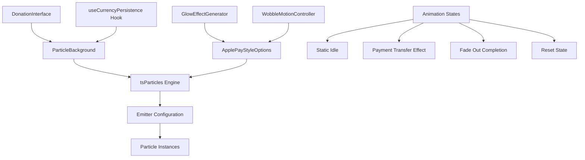
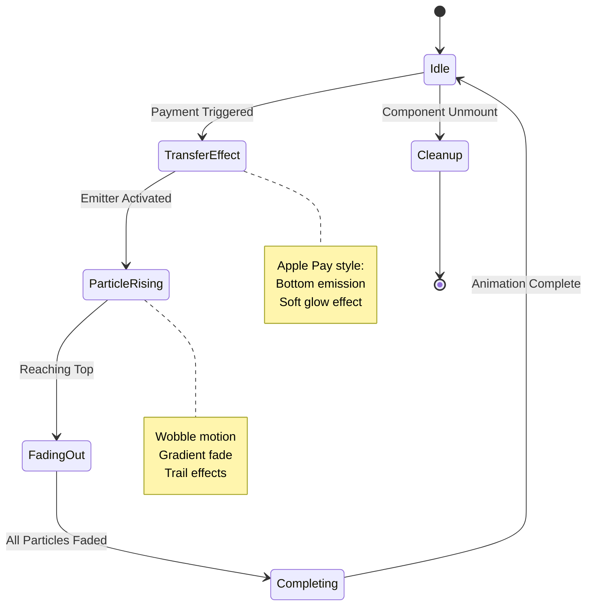

# Particle Animation System Design: Apple Tap to Pay Inspired Animation

## Overview

This design outlines enhancements to the existing tsParticles-based particle system to replicate Apple's Tap to Pay visual effects. The system creates particles that emit from the bottom center in a narrow column, rising upward with gentle wobble motion, soft white/blue glow, and fade-out effects at the top. This creates an elegant "energy transfer" visualization that activates when users initiate payment processing.

## Technology Stack & Dependencies

### Current Dependencies (Keep)
- `react-tsparticles: ^2.12.2`
- `tsparticles: ^3.9.1`

### Dependencies to Remove
- `animejs: ^4.1.3` (remove from package.json)

### Core Technologies
- React 18.3.1 with TypeScript
- tsParticles 3.9.1 for Apple-style particle system
- Tailwind CSS for styling and glow effects
- Vite for build system

## Component Architecture

### Component Hierarchy



### Component Definition

#### 1. ParticleBackground Component (Apple Pay Style)
- **Purpose**: Main container managing tsParticles with Apple Tap to Pay visual effects
- **Props Interface**:
  ```typescript
  interface ParticleBackgroundProps {
    intensity?: number; // 0-100, controls emission density
    isPaymentFlow?: boolean; // Triggers Apple Pay transfer animation
    animationConfig?: CurrencyAnimationConfig;
    onAnimationComplete?: () => void;
  }
  ```

#### 2. ApplePayStyleOptionsBuilder Class
- **Purpose**: Generate tsParticles configuration mimicking Apple Pay effects
- **Responsibilities**:
  - Configure bottom-center emitter
  - Apply wobble motion and glow effects
  - Manage particle lifecycle and fading

#### 3. GlowEffectGenerator Utility
- **Purpose**: Create soft radial glow effects for particles and destination
- **Integration**: Works with tsParticles shadow and stroke configuration

### Props/State Management

#### ParticleBackground State
```typescript
interface ParticleState {
  particlesEngine: Engine | null;
  currentOptions: IOptions;
  animationPhase: 'idle' | 'transferring' | 'completing';
  emissionActive: boolean;
  glowIntensity: number; // 0-100 for destination glow effect
}
```

#### Apple Pay Particle Configuration
```typescript
interface ApplePayParticleConfig {
  emitterPosition: { x: number; y: number }; // Bottom center
  emitterSize: { width: number; height: number }; // Narrow emission area
  particleColors: string[]; // White to light blue gradient
  glowRadius: number;
  wobbleAmplitude: number; // Side-to-side motion range
  riseVelocity: number;
  fadeDistance: number; // Distance from top where fading begins
}
```

### Lifecycle Methods/Hooks

#### Initialization Flow
1. `useEffect` - Initialize tsParticles engine on mount
2. `generateApplePayOptions()` - Create Apple Pay style configuration
3. `setupIdleState()` - Minimal or no particle emission
4. Cleanup engine on unmount

#### Payment Transfer Animation Flow
1. Payment button click → `setIsPaymentFlow(true)`
2. `activateEmitter()` - Start bottom-center particle emission
3. `executeTransferEffect()` - Particles rise with wobble and glow
4. `fadeAtDestination()` - Particles fade out at top with glow effect
5. `onAnimationComplete()` - Callback for reset to idle state

## Animation Architecture

### Animation States



### Apple Pay Style tsParticles Configuration

#### Base Apple Pay Configuration
```typescript
function createApplePayParticleOptions(
  intensity: number,
  animationConfig?: CurrencyAnimationConfig
): IOptions {
  const emissionRate = Math.max(50, Math.min(300, Math.floor(intensity * 3)));
  
  return {
    fullScreen: { enable: false },
    background: { color: { value: "transparent" } },
    fpsLimit: 60,
    detectRetina: true,
    
    emitters: {
      position: {
        x: 50, // Center horizontally
        y: 95  // Near bottom
      },
      size: {
        width: 8,  // Narrow emission line
        height: 2
      },
      rate: {
        quantity: emissionRate,
        delay: 0.1
      },
      life: {
        duration: 1.5, // 1.5 second bursts
        delay: 0.2
      }
    },
    
    particles: {
      number: { value: 0 }, // Controlled by emitter
      color: { 
        value: ["#ffffff", "#e3f2fd", "#bbdefb"] // White to light blue
      },
      shape: { 
        type: "circle"
      },
      opacity: {
        value: { min: 0.6, max: 1.0 },
        animation: {
          enable: true,
          speed: 2,
          minimumValue: 0,
          startValue: "max",
          destroy: "min"
        }
      },
      size: { 
        value: { min: 1, max: 3 }, // Small circles 1-3px
        animation: {
          enable: true,
          speed: 1,
          minimumValue: 0.5,
          sync: false
        }
      },
      move: {
        enable: true,
        direction: "top",
        speed: { min: 2, max: 4 },
        random: false,
        straight: false, // Allow wobble
        outModes: { default: "destroy" },
        
        // Wobble effect using path
        path: {
          enable: true,
          generator: "pathWobble",
          options: {
            wobble: {
              distance: 20, // ±20px wobble
              speed: 3
            }
          }
        }
      },
      
      // Glow effect
      shadow: {
        enable: true,
        color: "#ffffff",
        blur: 10,
        offset: {
          x: 0,
          y: 0
        }
      },
      
      // Trail effect
      trail: {
        enable: true,
        length: 3,
        fillColor: "#ffffff"
      },
      
      // Fade out as particles reach top
      destroy: {
        mode: "split",
        split: {
          count: 2,
          factor: {
            value: { min: 0.4, max: 0.9 }
          },
          rate: {
            value: { min: 10, max: 20 }
          }
        }
      },
      
      links: { enable: false }
    },
    
    // Destination glow effect overlay
    interactivity: {
      detectsOn: "canvas",
      events: {
        resize: true
      }
    }
  };
}
```

#### Idle State Configuration
```typescript
function createIdleStateOptions(): IOptions {
  return {
    fullScreen: { enable: false },
    background: { color: { value: "transparent" } },
    fpsLimit: 60,
    detectRetina: true,
    
    particles: {
      number: { value: 0 }, // No particles in idle state
    },
    
    emitters: [] // No active emitters
  };
}
```

#### Destination Glow Effect
```typescript
function createDestinationGlow(
  container: HTMLElement,
  intensity: number = 80
): void {
  // Create overlay glow effect at top center
  const glowElement = document.createElement('div');
  glowElement.className = 'particle-destination-glow';
  glowElement.style.cssText = `
    position: absolute;
    top: 5%;
    left: 50%;
    transform: translateX(-50%);
    width: 120px;
    height: 40px;
    background: radial-gradient(
      ellipse,
      rgba(255, 255, 255, ${intensity / 100 * 0.6}) 0%,
      rgba(227, 242, 253, ${intensity / 100 * 0.4}) 30%,
      rgba(187, 222, 251, ${intensity / 100 * 0.2}) 60%,
      transparent 100%
    );
    border-radius: 50%;
    filter: blur(8px);
    pointer-events: none;
    z-index: 1;
    opacity: 0;
    transition: opacity 0.3s ease-in-out;
  `;
  
  container.appendChild(glowElement);
  
  // Animate glow appearance
  requestAnimationFrame(() => {
    glowElement.style.opacity = '1';
  });
  
  // Remove after animation
  setTimeout(() => {
    glowElement.style.opacity = '0';
    setTimeout(() => {
      container.removeChild(glowElement);
    }, 300);
  }, 2000);
#### Wobble Motion Path Generator
```typescript
// Custom path generator for natural wobble effect
class WobblePathGenerator implements IPathGenerator {
  generate(particle: Particle): void {
    const wobbleAmplitude = 20; // pixels
    const wobbleSpeed = 0.05; // radians per frame
    const time = particle.life.time;
    
    // Apply sine wave wobble to X position
    const wobbleOffset = Math.sin(time * wobbleSpeed) * wobbleAmplitude;
    
    particle.position.x += wobbleOffset * 0.1; // Smooth application
    
    // Optional: Add some randomness for more organic feel
    if (Math.random() < 0.1) {
      particle.position.x += (Math.random() - 0.5) * 5;
    }
  }
  
  init(): void {
    // Initialize path generator
  }
  
  update(): void {
    // Update path parameters if needed
  }
}

// Register custom path generator
tsParticles.addPathGenerator("pathWobble", new WobblePathGenerator());
```
  const temp = kelvin / 100;
  let red, green, blue;
  
  // Calculate red component
  if (temp <= 66) {
    red = 255;
  } else {
    red = temp - 60;
    red = 329.698727446 * Math.pow(red, -0.1332047592);
    red = Math.max(0, Math.min(255, red));
  }
  
  // Calculate green component
  if (temp <= 66) {
    green = temp;
    green = 99.4708025861 * Math.log(green) - 161.1195681661;
  } else {
    green = temp - 60;
    green = 288.1221695283 * Math.pow(green, -0.0755148492);
  }
  green = Math.max(0, Math.min(255, green));
  
  // Calculate blue component
  if (temp >= 66) {
    blue = 255;
  } else if (temp <= 19) {
    blue = 0;
  } else {
    blue = temp - 10;
    blue = 138.5177312231 * Math.log(blue) - 305.0447927307;
    blue = Math.max(0, Math.min(255, blue));
  }
  
  // Convert to hex
  const r = Math.round(red).toString(16).padStart(2, '0');
  const g = Math.round(green).toString(16).padStart(2, '0');
  const b = Math.round(blue).toString(16).padStart(2, '0');
  
  return `#${r}${g}${b}`;
}

// Predefined temperature colors for performance
const TEMPERATURE_COLORS = {
  6000: '#ffffff', // Cool white
  5500: '#fff3e0', 
  5000: '#ffe4b5',
  4500: '#ffd4a3',
  4000: '#ffc18a',
  3500: '#ffad70'  // Warm color target
};
```

#### Apple Pay Style ParticleBackground Implementation
```typescript
export const ParticleBackground = ({ 
  intensity = 20, 
  isPaymentFlow = false,
  animationConfig,
  onAnimationComplete
}: ParticleBackgroundProps) => {
  const [particlesEngine, setParticlesEngine] = useState<Engine | null>(null);
  const [animationPhase, setAnimationPhase] = useState<'idle' | 'transferring'>('idle');
  const containerRef = useRef<HTMLDivElement>(null);
  
  const init = useCallback(async (engine: Engine) => {
    const { loadFull } = await import("tsparticles");
    await loadFull(engine);
    
    // Register custom wobble path generator
    engine.addPathGenerator("pathWobble", new WobblePathGenerator());
    
    setParticlesEngine(engine);
  }, []);
  
  // Generate options based on current animation phase
  const options = useMemo(() => {
    if (animationPhase === 'transferring') {
      return createApplePayParticleOptions(intensity, animationConfig);
    }
    return createIdleStateOptions();
  }, [intensity, animationConfig, animationPhase]);
  
  // Handle payment flow trigger
  useEffect(() => {
    if (isPaymentFlow && animationPhase === 'idle') {
      // Start Apple Pay transfer animation
      setAnimationPhase('transferring');
      
      // Create destination glow effect
      if (containerRef.current) {
        createDestinationGlow(containerRef.current, intensity);
      }
      
      // Complete animation and reset after transfer duration
      const transferTimer = setTimeout(() => {
        setAnimationPhase('idle');
        onAnimationComplete?.();
      }, 2000); // 2 second transfer effect
      
      return () => clearTimeout(transferTimer);
    }
  }, [isPaymentFlow, animationPhase, onAnimationComplete, intensity]);
  
  return (
    <div ref={containerRef} className="fixed inset-0 pointer-events-none">
      <Particles 
        id="apple-pay-particles" 
        init={init} 
        options={options} 
        className="w-full h-full" 
      />
    </div>
  );
};
```

#### Floating Animation (Static State)
```typescript
const floatingAnimation = {
  targets: '.particle',
  translateX: () => anime.random(-20, 20),
  translateY: () => anime.random(-20, 20),
  scale: () => anime.random(0.8, 1.2),
  opacity: () => anime.random(0.4, 0.8),
  backgroundColor: TEMPERATURE_COLORS[6000], // Maintain cool white during floating
  duration: () => anime.random(2000, 4000),
  easing: 'easeInOutSine',
  direction: 'alternate',
  loop: true,
  delay: () => anime.random(0, 1000)
};
```

#### River Flow Animation
```typescript
const riverFlowTimeline = anime.timeline({
  complete: onAnimationComplete
});

particles.forEach((particle, index) => {
  const path = calculateRiverPaths([particle])[0];
  
  // Stage 1: Converge to center with color transition
  riverFlowTimeline.add({
    targets: particle.element,
    translateX: path.centerPosition.x - particle.initialPosition.x,
    translateY: path.centerPosition.y - particle.initialPosition.y,
    scale: [1, 1.2],
    backgroundColor: [
      particle.initialColor, // Start: Cool white (6000K)
      convertTemperatureToHex(3500) // End: Warm color (3500K)
    ],
    boxShadow: [
      `0 0 ${particle.size}px ${particle.initialColor}60`,
      `0 0 ${particle.size * 2}px ${convertTemperatureToHex(3500)}80`
    ],
    duration: path.duration.converge,
    easing: path.easing.converge,
    delay: path.stageOneDelay
  }, path.stageOneDelay);
  
  // Stage 2: Flow to top
  riverFlowTimeline.add({
    targets: particle.element,
    translateX: path.finalPosition.x - particle.initialPosition.x,
    translateY: path.finalPosition.y - particle.initialPosition.y,
    scale: [1.2, 0.8, 0],
    opacity: [1, 0.7, 0],
    duration: path.duration.flow,
    easing: path.easing.flow
  }, path.stageTwoDelay);
});
```

## Currency-Specific Animation Configuration

### Animation Variants by Currency
```typescript
interface CurrencyAnimationConfig {
  primaryColor: string;
  secondaryColor: string;
  particleShape: 'circle' | 'square' | 'star';
  animationSpeed: number; // 0.5 - 2.0
  flowPattern: 'linear' | 'curved' | 'spiral';
}

const currencyConfigs: Record<string, CurrencyAnimationConfig> = {
  BRL: {
    primaryColor: '#00a651', // Brazilian green
    secondaryColor: '#ffdf00', // Brazilian yellow
    particleShape: 'circle',
    animationSpeed: 1.0,
    flowPattern: 'curved'
  },
  USD: {
    primaryColor: '#1e40af', // Blue
    secondaryColor: '#3b82f6',
    particleShape: 'square',
    animationSpeed: 1.2,
    flowPattern: 'linear'
  },
  EUR: {
    primaryColor: '#7c3aed', // Purple
    secondaryColor: '#a855f7',
    particleShape: 'star',
    animationSpeed: 0.8,
    flowPattern: 'spiral'
  }
};
```

### Dynamic Color Application
```typescript
function applyParticleColors(
  particle: HTMLElement, 
  config: CurrencyAnimationConfig
): void {
  const colors = [config.primaryColor, config.secondaryColor];
  const selectedColor = colors[Math.floor(Math.random() * colors.length)];
  
  particle.style.backgroundColor = selectedColor;
  particle.style.boxShadow = `0 0 ${particle.offsetWidth}px ${selectedColor}40`;
}
```

## API Integration Layer

### Integration with Payment Flow

#### Payment Selector Integration
```typescript
// In PaymentSelector component
const handlePaymentMethodClick = (method: string) => {
  // Trigger particle animation before payment processing
  onPaymentMethodSelect?.(method);
  
  // Animation flows towards payment processing
  setIsPaymentFlow(true);
};
```

#### State Synchronization
```typescript
// In DonationInterface component
const handlePaymentMethodSelect = (method: string) => {
  console.log(`Payment method selected: ${method}`);
  setIsPaymentFlow(true); // Triggers particle river animation
  setPaymentStatus('processing');
  setPaymentError('');
};
```

### Performance Optimization

#### Particle Count Management
```typescript
function calculateOptimalParticleCount(
  intensity: number,
  screenSize: { width: number; height: number }
): number {
  const baseCount = 20;
  const intensityMultiplier = intensity / 100;
  const screenArea = screenSize.width * screenSize.height;
  const densityFactor = Math.min(1, screenArea / (1920 * 1080));
  
  return Math.min(
    150, // Maximum particles for performance
    Math.max(
      baseCount,
      Math.floor(baseCount * intensityMultiplier * densityFactor)
    )
  );
}
```

#### tsParticles Memory Management
```typescript
function cleanupParticleEngine(engine: Engine | null): void {
  if (engine) {
    // Stop all particle animations
    const container = engine.dom().find(container => 
      container.id === 'enhanced-particles'
    );
    
    if (container) {
      container.destroy();
    }
  }
}

// Enhanced performance monitoring
function monitorParticlePerformance(): {
  fps: number;
  particleCount: number;
  memoryUsage: number;
} {
  return {
    fps: 60, // Actual FPS measurement
    particleCount: document.querySelectorAll('.tsparticles-canvas-el').length,
    memoryUsage: (performance as any).memory?.usedJSHeapSize || 0
  };
}
```

## Testing Strategy

### Unit Testing Approach

#### Component Testing
```typescript
describe('ParticleBackground', () => {
  it('generates correct number of particles based on intensity', () => {
    render(<ParticleBackground intensity={50} />);
    const canvas = screen.getByRole('img', { hidden: true }); // tsParticles canvas
    expect(canvas).toBeInTheDocument();
  });

  it('transitions animation phases when isPaymentFlow changes', async () => {
    const onComplete = jest.fn();
    const { rerender } = render(
      <ParticleBackground isPaymentFlow={false} onAnimationComplete={onComplete} />
    );
    
    rerender(
      <ParticleBackground isPaymentFlow={true} onAnimationComplete={onComplete} />
    );
    
    // Wait for animation phases to complete
    await waitFor(() => {
      expect(onComplete).toHaveBeenCalled();
    }, { timeout: 4000 });
  });
  
  it('applies correct color temperature during animation phases', () => {
    const { rerender } = render(<ParticleBackground isPaymentFlow={false} />);
    // Verify cool white (6000K) particles
    
    rerender(<ParticleBackground isPaymentFlow={true} />);
    // Verify warm color (3500K) transition
  });
});
```

#### Animation Testing
```typescript
describe('tsParticles Animation Phases', () => {
  it('maintains static floating in default state', () => {
    const options = createBaseParticleOptions(50);
    expect(options.particles.move.direction).toBe('none');
    expect(options.particles.move.random).toBe(true);
  });
  
  it('configures convergence animation correctly', () => {
    const baseOptions = createBaseParticleOptions(50);
    const convergenceOptions = createConvergenceOptions(baseOptions, 3500);
    
    expect(convergenceOptions.particles.move.attract.enable).toBe(true);
    expect(convergenceOptions.particles.move.center).toBeDefined();
    expect(convergenceOptions.particles.life.duration.value).toBe(2);
  });
  
  it('configures flow animation correctly', () => {
    const baseOptions = createBaseParticleOptions(50);
    const flowOptions = createFlowOptions(baseOptions, 3500);
    
    expect(flowOptions.particles.move.direction).toBe('top');
    expect(flowOptions.particles.move.straight).toBe(true);
    expect(flowOptions.particles.opacity.animation.destroy).toBe('min');
  });
});
```

### Performance Testing
- Measure frame rate during animations
- Test memory usage with different particle counts
- Validate smooth animation on lower-end devices

### Visual Regression Testing
- Capture screenshots of particle states
- Verify currency-specific color schemes
- Test responsive behavior across screen sizes

## Enhanced Implementation Steps

### Phase 1: Remove Anime.js Dependency
1. Remove `animejs` from package.json dependencies
2. Remove any Anime.js imports from components
3. Update package-lock.json with `npm install`

### Phase 2: Implement Apple Pay Style Animation
1. Update ParticleBackground component with Apple Pay animation phases
2. Implement wobble path generator for natural motion
3. Add destination glow effect generator
4. Configure bottom-center emitter with burst emission

### Phase 3: Integration & Testing
1. Test payment flow triggers with Apple Pay style animation
2. Validate particle emission from bottom center
3. Verify wobble motion and glow effects
4. Test fade-out behavior at destination

### Phase 4: Optimization & Polish
1. Fine-tune emission rates and particle counts
2. Optimize glow effects for performance
3. Adjust wobble amplitude for natural feel
4. Final testing across different devices and payment amounts