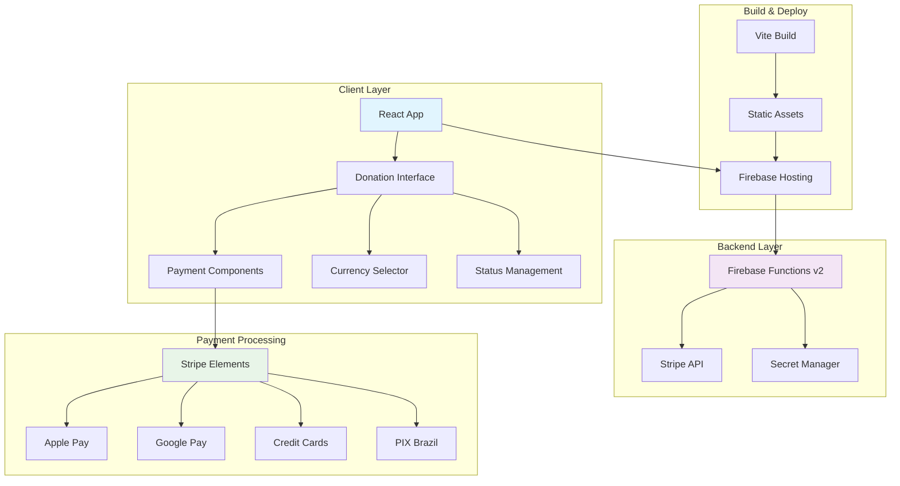
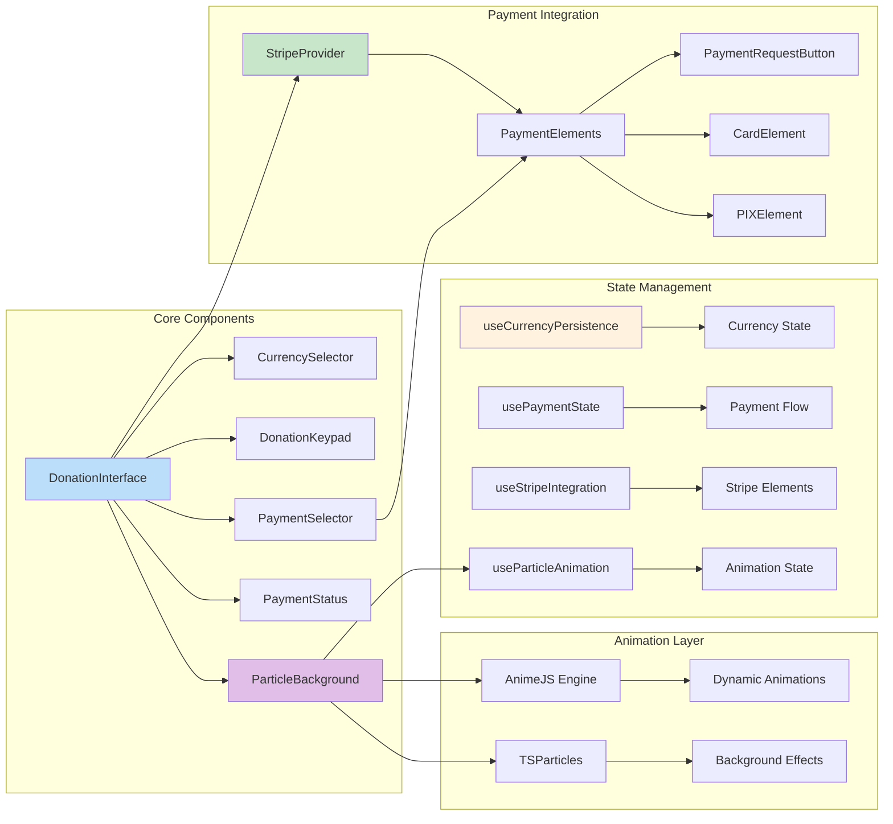
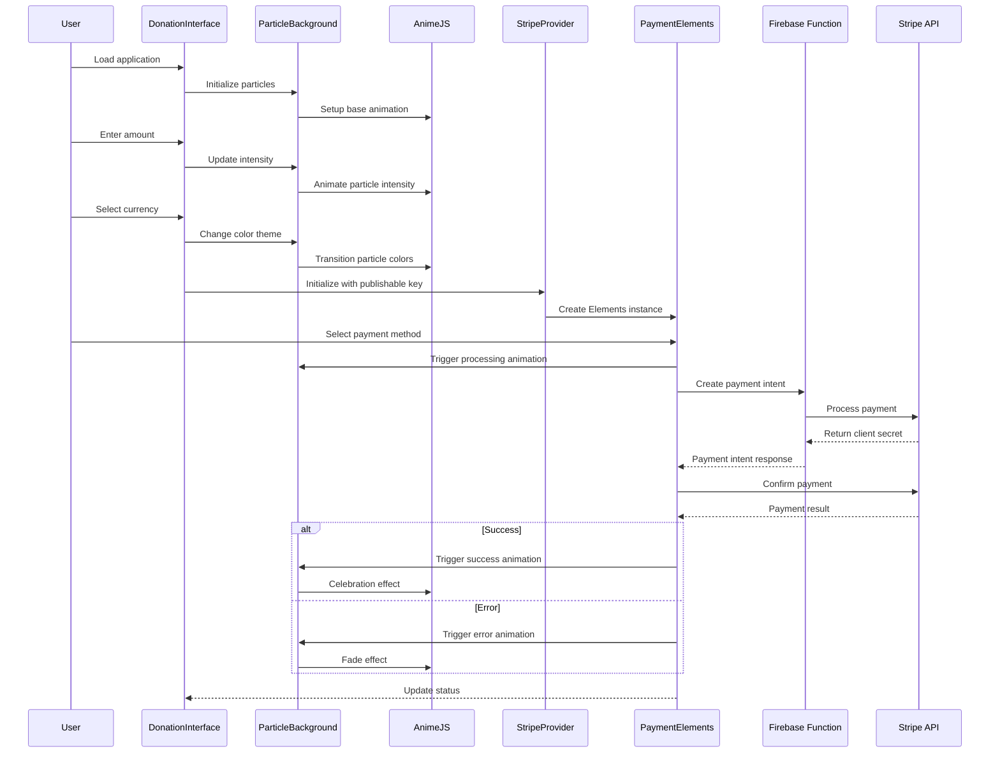
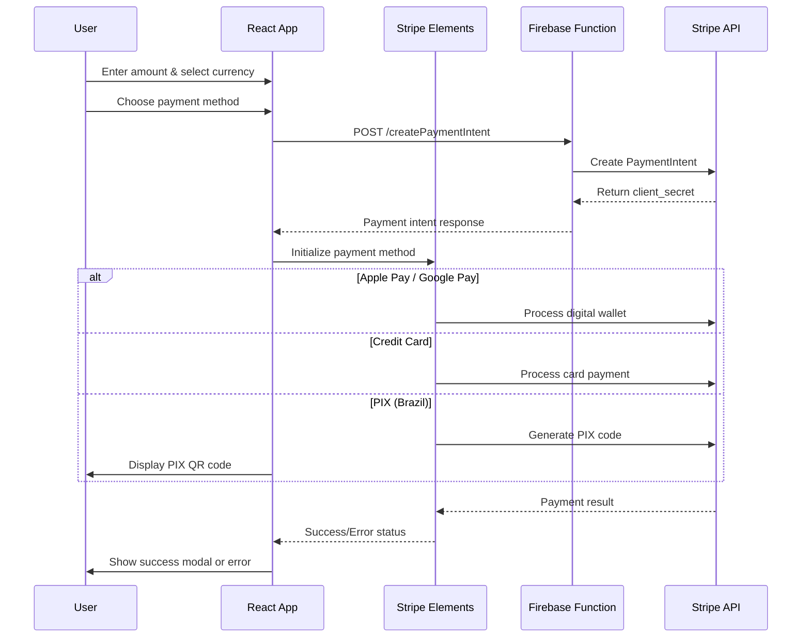
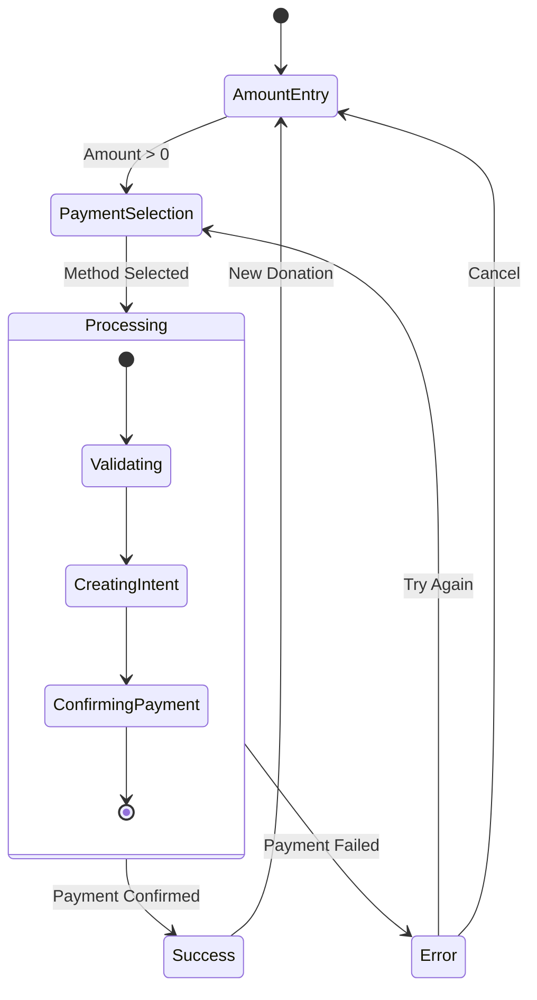
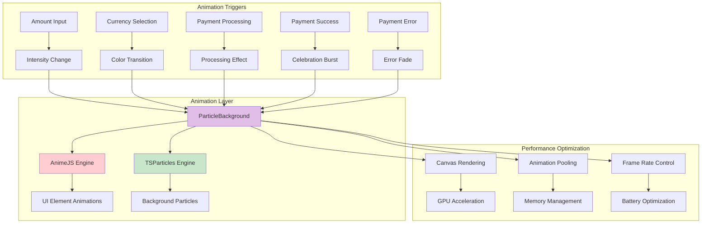

# Project Integration Design: TapToSow React Application Migration

## Overview

This design documents the integration of the send-din-din React application into the main TapToSow project, replacing the current simple HTML implementation with a modern React-based donation interface. The integration will maintain all existing payment functionality while enhancing the user experience with a sophisticated UI built using React, TypeScript, and shadcn/ui components.

## Current State Analysis

### Existing Implementation
- **Current Stack**: Static HTML with vanilla JavaScript
- **Payment Integration**: Full Stripe integration with Apple Pay, Google Pay, and manual card entry
- **Currency Support**: Multi-currency support (BRL, USD, EUR, GBP, CAD, AUD, JPY)
- **Backend**: Firebase Functions v2 with secure secret management
- **Hosting**: Firebase Hosting with function rewrites

### Target React Application
- **Framework**: React 18 with TypeScript
- **Build Tool**: Vite
- **UI Components**: shadcn/ui with Tailwind CSS
- **State Management**: React hooks with local state
- **Router**: React Router DOM
- **Current Status**: Template implementation without payment integration

## Repository Type Classification

**Classification**: Full-Stack Application with Frontend Component Library Elements

The project combines:
- Frontend React application (payment interface)
- Backend Firebase Functions (payment processing)
- UI component library (shadcn/ui components)
- Static hosting with dynamic API routing

## Architecture

### System Architecture Overview



### Component Architecture



## Component Integration Plan

### 1. Stripe Integration Layer

**New Components to Add:**
- `StripeProvider.tsx` - Stripe context provider
- `PaymentForm.tsx` - Stripe Elements integration
- `useStripePayment.ts` - Payment processing hook
- `usePaymentRequest.ts` - Digital wallet integration

### 2. Animation Integration Layer

**Particle Background System:**
- `ParticleBackground.tsx` - Main particle animation component
- `useParticleAnimation.ts` - Animation state management hook
- `animationConfig.ts` - Animation configuration constants
- `particleEffects.ts` - Custom particle effect definitions

**Animation Features:**
```typescript
interface ParticleConfig {
  intensity: number; // 0-100 based on donation amount
  color: string; // Dynamic based on currency/theme
  speed: number; // Animation speed
  count: number; // Particle count
  shape: 'circle' | 'triangle' | 'star';
  behavior: 'float' | 'burst' | 'spiral';
}

interface AnimationState {
  isActive: boolean;
  currentAnimation: string;
  intensity: number;
  trigger: (effect: string) => void;
  updateIntensity: (value: number) => void;
}
```

**Dynamic Animation Triggers:**
- Amount input changes particle intensity
- Currency selection triggers color transitions
- Payment processing shows burst effects
- Success state displays celebration animation
- Error state shows subtle fade effects

### 3. Integration Points


### 4. Payment Method Implementation

#### Apple Pay & Google Pay Integration
```typescript
interface PaymentRequestConfig {
  country: string;
  currency: string;
  total: {
    label: string;
    amount: number;
  };
  requestPayerName: boolean;
  requestPayerEmail: boolean;
  disableWallets: ['link'];
}
```

#### PIX Integration for Brazil
```typescript
interface PIXPaymentConfig {
  currency: 'brl';
  paymentMethodTypes: ['pix'];
  amount: number;
  metadata: {
    payment_method: 'pix';
    country: 'BR';
  };
}
```

#### Manual Card Entry
```typescript
interface CardElementConfig {
  style: CardElementStyle;
  hidePostalCode: boolean;
  disableLink: boolean;
}
```

### 5. Currency Localization

**Enhanced Currency Support:**
- Dynamic currency detection based on browser locale
- Persistent currency selection using cookies
- Real-time symbol updates across all components
- Stripe-compatible currency formatting
- **Animation sync with currency changes**

**Currency Configuration:**
```typescript
interface CurrencyConfig {
  code: string;
  symbol: string;
  name: string;
  country: string;
  minimumAmount: number;
  decimalPlaces: number;
  themeColor: string; // For particle color coordination
}
```

**Animation Integration:**
```typescript
interface CurrencyAnimationConfig {
  [key: string]: {
    primaryColor: string;
    secondaryColor: string;
    particleShape: 'circle' | 'triangle' | 'star';
    animationSpeed: number;
  };
}

const currencyAnimations: CurrencyAnimationConfig = {
  'USD': { primaryColor: '#22c55e', secondaryColor: '#86efac', particleShape: 'circle', animationSpeed: 1.0 },
  'BRL': { primaryColor: '#22d3ee', secondaryColor: '#7dd3fc', particleShape: 'triangle', animationSpeed: 1.2 },
  'EUR': { primaryColor: '#8b5cf6', secondaryColor: '#c4b5fd', particleShape: 'star', animationSpeed: 0.8 },
  // ... other currencies
};
```

### 6. Success/Error Flow Integration

**Success Modal Enhancement:**
- Full-screen animated overlay
- Payment confirmation details
- Receipt-style formatting
- "Make Another Donation" functionality
- **Celebration particle effects with AnimeJS**

**Error Handling:**
- Specific error messages for different failure types
- Retry mechanisms for transient failures
- Payment method fallback suggestions
- User-friendly error descriptions
- **Subtle error animation effects**

**Animation States:**
```typescript
interface PaymentAnimationStates {
  processing: {
    effect: 'pulse';
    intensity: 'medium';
    duration: 'continuous';
  };
  success: {
    effect: 'burst';
    intensity: 'high';
    duration: '3s';
    celebration: true;
  };
  error: {
    effect: 'fade';
    intensity: 'low';
    duration: '1s';
    shake: true;
  };
}
```

## Technology Stack & Dependencies

### Frontend Dependencies
```json
{
  "core": {
    "react": "^18.3.1",
    "react-dom": "^18.3.1",
    "typescript": "^5.8.3"
  },
  "ui": {
    "@radix-ui/react-*": "latest",
    "tailwindcss": "^3.4.17",
    "lucide-react": "^0.462.0"
  },
  "animations": {
    "animejs": "^4.1.3",
    "react-tsparticles": "^2.12.2",
    "tsparticles": "^3.9.1"
  },
  "payment": {
    "@stripe/stripe-js": "^2.4.0",
    "@stripe/react-stripe-js": "^2.4.0"
  },
  "routing": {
    "react-router-dom": "^6.30.1"
  },
  "state": {
    "@tanstack/react-query": "^5.83.0"
  },
  "build": {
    "vite": "^5.4.19",
    "@vitejs/plugin-react-swc": "^3.11.0"
  }
}
```

### Backend Dependencies (Existing)
```json
{
  "firebase-functions": "^4.x",
  "stripe": "^14.x",
  "cors": "^2.x"
}
```

## Hosting Strategy Analysis

### Firebase Hosting vs App Hosting

**Current Firebase Hosting Advantages:**
- Already configured and working
- Simple deployment process
- Built-in SSL and CDN
- Function rewrites already set up
- Cost-effective for static assets

**Firebase App Hosting Considerations:**
- Designed for dynamic applications
- Better for SSR/SSG scenarios
- More complex deployment
- Higher cost for simple static apps

**Recommendation**: Continue with Firebase Hosting
- The React app builds to static assets
- Existing function rewrites work perfectly
- No server-side rendering requirements
- Simpler deployment and maintenance

### Deployment Configuration

**Updated firebase.json:**
```json
{
  "hosting": {
    "public": "dist",
    "ignore": ["firebase.json", "**/.*", "**/node_modules/**"],
    "rewrites": [
      {
        "source": "/createPaymentIntent",
        "function": "createPaymentIntent"
      },
      {
        "source": "**",
        "destination": "/index.html"
      }
    ]
  }
}
```

**Build Process:**
```bash
# Development
npm run dev

# Production build
npm run build

# Deploy
firebase deploy
```

## API Integration Layer

### Payment Processing Flow



### Enhanced Error Handling

**Error Categories:**
1. **Validation Errors**: Amount too low, unsupported currency
2. **Payment Errors**: Card declined, insufficient funds
3. **Network Errors**: Connection issues, timeout
4. **Integration Errors**: Invalid API keys, configuration issues

**Error Response Format:**
```typescript
interface PaymentError {
  code: string;
  message: string;
  type: 'validation' | 'payment' | 'network' | 'integration';
  retryable: boolean;
  suggestedAction?: string;
}
```

## State Management Architecture

### Payment State Flow



### Currency State Management

**Persistence Strategy:**
- Browser cookies for long-term storage
- React state for real-time updates
- Automatic locale detection on first visit
- Fallback to BRL as default

**State Updates:**
```typescript
interface CurrencyState {
  current: Currency;
  detected: Currency;
  history: Currency[];
  updateCurrency: (currency: Currency) => void;
  detectCurrency: () => Promise<Currency>;
}
```

## Testing Strategy

### Component Testing
```typescript
// Example test structure
describe('DonationInterface', () => {
  it('should handle amount input correctly');
  it('should update currency selection');
  it('should process payments through Stripe');
  it('should display success/error states');
  it('should render particle animations correctly');
  it('should sync animation intensity with amount changes');
});

describe('ParticleBackground', () => {
  it('should initialize with default animation');
  it('should update intensity based on props');
  it('should transition colors on currency change');
  it('should trigger celebration on success');
  it('should handle animation cleanup on unmount');
});
```

### Integration Testing
- Stripe test environment integration
- Payment flow end-to-end testing
- Currency conversion testing
- Error scenario testing
- **Animation performance testing**
- **Cross-browser animation compatibility**

### Testing Configuration
```typescript
// Test environment setup
const testStripeConfig = {
  publishableKey: 'pk_test_...',
  secretKey: 'sk_test_...',
  webhookSecret: 'whsec_test_...'
};
```

## Security Considerations

### API Key Management
- **Frontend**: Only publishable keys in client code
- **Backend**: Secret keys in Firebase Secret Manager
- **Environment**: Separate test/production configurations

### Payment Security
- PCI DSS compliance through Stripe Elements
- No sensitive payment data stored locally
- Secure communication over HTTPS only
- Input validation and sanitization

### Data Privacy
- Minimal data collection
- No storage of payment information
- Cookie-based currency preferences only
- GDPR-compliant data handling

## Animation Architecture

### Particle Background System

The particle background system uses a combination of AnimeJS and TSParticles to create dynamic, responsive animations that react to user interactions and payment states.



### Animation Configuration

**Base Particle Configuration:**
```typescript
interface BaseParticleConfig {
  count: number;
  size: {
    min: number;
    max: number;
  };
  speed: {
    min: number;
    max: number;
  };
  opacity: {
    min: number;
    max: number;
  };
  color: string[];
  shape: 'circle' | 'triangle' | 'star' | 'polygon';
}

const defaultConfig: BaseParticleConfig = {
  count: 50,
  size: { min: 1, max: 3 },
  speed: { min: 0.5, max: 2 },
  opacity: { min: 0.1, max: 0.6 },
  color: ['#3b82f6', '#06b6d4', '#10b981'],
  shape: 'circle'
};
```

**Dynamic Animation States:**
```typescript
interface AnimationState {
  idle: {
    particleCount: 30;
    speed: 1;
    opacity: 0.3;
    effect: 'float';
  };
  interacting: {
    particleCount: 50;
    speed: 1.5;
    opacity: 0.5;
    effect: 'drift';
  };
  processing: {
    particleCount: 80;
    speed: 2.5;
    opacity: 0.7;
    effect: 'pulse';
  };
  success: {
    particleCount: 150;
    speed: 4;
    opacity: 0.9;
    effect: 'burst';
    duration: 3000;
  };
  error: {
    particleCount: 20;
    speed: 0.5;
    opacity: 0.2;
    effect: 'fade';
    duration: 1000;
  };
}
```

### Animation Hooks

**useParticleAnimation Hook:**
```typescript
interface UseParticleAnimation {
  intensity: number;
  setIntensity: (value: number) => void;
  triggerEffect: (effect: AnimationEffect) => void;
  updateTheme: (theme: AnimationTheme) => void;
  isAnimating: boolean;
  currentEffect: string;
}

const useParticleAnimation = (): UseParticleAnimation => {
  const [intensity, setIntensity] = useState(10);
  const [currentEffect, setCurrentEffect] = useState('idle');
  const [isAnimating, setIsAnimating] = useState(true);
  
  const triggerEffect = useCallback((effect: AnimationEffect) => {
    setCurrentEffect(effect.name);
    setIsAnimating(true);
    
    // Auto-reset after effect duration
    if (effect.duration) {
      setTimeout(() => {
        setCurrentEffect('idle');
      }, effect.duration);
    }
  }, []);
  
  return {
    intensity,
    setIntensity,
    triggerEffect,
    updateTheme,
    isAnimating,
    currentEffect
  };
};
```

### Performance Optimization

**Canvas Optimization:**
- Hardware acceleration enabled by default
- Particle pooling to reduce garbage collection
- Frame rate limiting for battery conservation
- Automatic quality adjustment based on device performance

**Memory Management:**
- Automatic cleanup on component unmount
- Particle count scaling based on device capabilities
- Effect debouncing to prevent animation spam
- Lazy loading of complex effects

**Responsive Behavior:**
```typescript
interface ResponsiveAnimationConfig {
  mobile: {
    maxParticles: 30;
    reducedEffects: true;
    frameRate: 30;
  };
  tablet: {
    maxParticles: 60;
    reducedEffects: false;
    frameRate: 45;
  };
  desktop: {
    maxParticles: 100;
    reducedEffects: false;
    frameRate: 60;
  };
}
```

## Migration Implementation Plan

### Phase 1: Project Setup (Week 1)
1. **Stripe Dependencies**: Add @stripe/stripe-js and @stripe/react-stripe-js
2. **Animation Dependencies**: Add animejs, react-tsparticles, and tsparticles
3. **Environment Configuration**: Set up Stripe publishable keys
4. **Component Structure**: Create base payment and animation components
5. **Basic Integration**: Connect with existing Firebase functions
6. **Particle System Setup**: Initialize ParticleBackground component

### Phase 2: Payment Integration (Week 2)
1. **Apple Pay/Google Pay**: Implement digital wallet support
2. **Card Payments**: Integrate manual card entry
3. **PIX Support**: Add Brazil-specific payment method
4. **Currency System**: Implement dynamic currency selection
5. **Animation Sync**: Connect payment states with particle effects
6. **Dynamic Intensity**: Link donation amounts to animation intensity

### Phase 3: UI/UX Enhancement (Week 3)
1. **Success Modals**: Create animated success overlays with celebration effects
2. **Error Handling**: Implement comprehensive error states with subtle animations
3. **Loading States**: Add payment processing indicators with pulse effects
4. **Responsive Design**: Ensure mobile-first optimization
5. **Animation Polish**: Fine-tune particle effects and transitions
6. **Performance Optimization**: Optimize animation performance and memory usage

### Phase 4: Testing & Deployment (Week 4)
1. **Integration Testing**: End-to-end payment flow testing
2. **Error Scenario Testing**: Test various failure conditions
3. **Cross-browser Testing**: Ensure compatibility
4. **Animation Performance Testing**: Validate smooth animations across devices
5. **Accessibility Testing**: Ensure animations don't interfere with accessibility
6. **Production Deployment**: Deploy to Firebase Hosting

## Migration Rules and Requirements

### Mandatory Features to Implement

1. **Complete Stripe Integration**
   - Apple Pay and Google Pay support
   - Manual credit card entry
   - PIX payment method for Brazilian Real
   - Payment request button implementation

2. **Currency Selection System**
   - Multi-currency support with all existing currencies
   - Dynamic currency detection based on locale
   - Persistent currency selection
   - Real-time symbol updates

3. **Success and Error Messaging**
   - Full-screen success modal with animation
   - Detailed error messages with retry options
   - Payment confirmation details
   - "Make Another Donation" functionality

4. **Manual Card Interface**
   - Stripe Elements integration
   - Real-time validation
   - Secure input handling
   - Proper error display

5. **PIX Integration for Brazil**
   - PIX QR code generation
   - PIX logo display
   - Copy-to-clipboard functionality
   - Brazil-specific messaging

### Technical Requirements

1. **Firebase Hosting Compatibility**
   - Build output to `dist` directory
   - Maintain existing function rewrites
   - Preserve SSL and CDN benefits
   - No breaking changes to deployment

2. **Backend Compatibility**
   - Use existing Firebase Functions v2
   - Maintain current API endpoints
   - Preserve secret management system
   - No changes to payment processing logic

3. **Performance Standards**
   - Fast initial load time
   - Smooth animations and transitions (60fps target)
   - Responsive design for all devices
   - Optimized bundle size
   - Efficient particle rendering with canvas optimization

4. **Security Compliance**
   - PCI DSS compliance through Stripe
   - Secure API key management
   - No sensitive data in client code
   - HTTPS-only communication

### Integration Constraints

1. **Existing Function Compatibility**
   - Must work with current createPaymentIntent function
   - No changes to backend API contract
   - Maintain currency support structure
   - Preserve metadata format

2. **Browser Support**
   - Modern browsers with ES2015+ support
   - Mobile Safari and Chrome compatibility
   - Progressive enhancement for older browsers
   - Graceful degradation for unsupported features

3. **Deployment Consistency**
   - Single deployment process
   - No separate backend deployments
   - Maintain existing CI/CD if present
   - Zero-downtime deployment capability