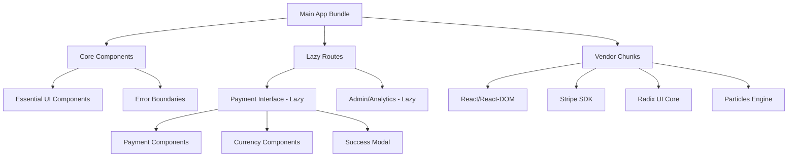
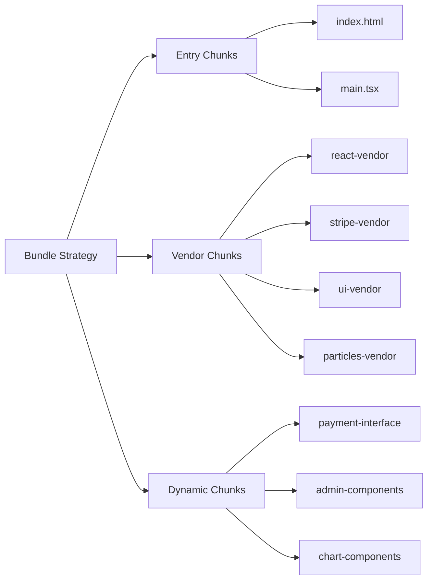
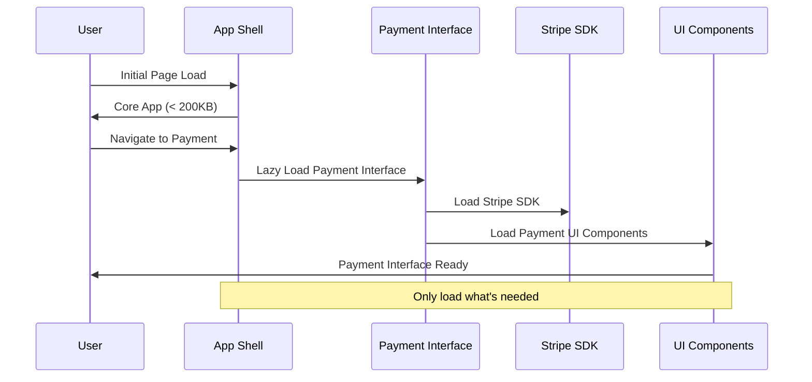

# Bundle Optimization and Code Splitting Design

## Overview

This document outlines the design for optimizing bundle size and implementing code splitting in the TapToSow React application to address the Vite build warning about large chunks exceeding 500 kB after minification.

## Current State Analysis

The application is a React-based donation platform built with:
- **Frontend**: React 18 + TypeScript + Vite
- **UI Library**: Radix UI components (49 UI components)
- **Payment Integration**: Stripe with multiple payment methods
- **Particles**: tsparticles for visual effects
- **Build Tool**: Vite with SWC compiler

### Identified Large Bundle Contributors

1. **Radix UI Components**: 49 UI components loaded regardless of usage
2. **Stripe Integration**: Payment libraries loaded upfront
3. **Particle System**: tsparticles engine and effects
4. **Chart Libraries**: Recharts for potential analytics
5. **Form Libraries**: React Hook Form + validation

## Architecture Design

### Code Splitting Strategy



### Bundle Chunk Configuration



## Implementation Strategy

### 1. Route-Level Code Splitting

#### Dynamic Import Strategy
- Convert main payment interface to lazy-loaded component
- Implement loading states for better UX
- Split admin/analytics features into separate chunks

#### Route Splitting Implementation
```typescript
// Lazy load major feature components
const PaymentInterface = lazy(() => import('./components/DonationInterface'))
const AdminDashboard = lazy(() => import('./pages/AdminDashboard'))
const Analytics = lazy(() => import('./pages/Analytics'))
```

### 2. Component-Level Code Splitting

#### UI Component Optimization
- Lazy load non-critical Radix UI components
- Bundle only essential UI components in main chunk
- Split modal/dialog components into separate chunks

#### Payment Component Splitting
```typescript
// Split payment components by functionality
const CardPaymentForm = lazy(() => import('./components/CardPaymentForm'))
const SuccessModal = lazy(() => import('./components/SuccessModal'))
const ParticleBackground = lazy(() => import('./components/ParticleBackground'))
```

### 3. Vendor Chunk Optimization

#### Manual Chunk Configuration
```typescript
// Group related vendor libraries
const chunks = {
  'react-vendor': ['react', 'react-dom', 'react-router-dom'],
  'stripe-vendor': ['@stripe/stripe-js', '@stripe/react-stripe-js'],
  'ui-vendor': [/@radix-ui\/.*/],
  'particles-vendor': ['@tsparticles/react', '@tsparticles/slim'],
  'form-vendor': ['react-hook-form', '@hookform/resolvers', 'zod'],
  'chart-vendor': ['recharts']
}
```

## Build Configuration Updates

### Vite Configuration Enhancement

```typescript
export default defineConfig({
  build: {
    rollupOptions: {
      output: {
        manualChunks: {
          // Core framework
          'react-vendor': ['react', 'react-dom', 'react-router-dom'],

          // Payment processing
          'stripe-vendor': ['@stripe/stripe-js', '@stripe/react-stripe-js'],

          // UI components (split by usage frequency)
          'ui-core': [
            '@radix-ui/react-slot',
            '@radix-ui/react-dialog',
            '@radix-ui/react-button'
          ],
          'ui-extended': [
            '@radix-ui/react-accordion',
            '@radix-ui/react-carousel',
            '@radix-ui/react-navigation-menu'
          ],

          // Visual effects
          'particles-vendor': ['@tsparticles/react', '@tsparticles/slim'],

          // Forms and validation
          'form-vendor': ['react-hook-form', '@hookform/resolvers', 'zod'],

          // Charts and analytics
          'chart-vendor': ['recharts']
        },
        chunkFileNames: (chunkInfo) => {
          const facadeModuleId = chunkInfo.facadeModuleId
          if (facadeModuleId?.includes('node_modules')) {
            return 'vendor/[name]-[hash].js'
          }
          return 'chunks/[name]-[hash].js'
        }
      }
    },
    chunkSizeWarningLimit: 1000, // Increase warning threshold temporarily
    target: 'esnext',
    minify: 'terser',
    terserOptions: {
      compress: {
        drop_console: true,
        drop_debugger: true
      }
    }
  }
})
```

### Chunk Size Targets

| Chunk Type | Target Size | Priority |
|------------|-------------|----------|
| Main Bundle | < 200KB | Critical |
| React Vendor | < 150KB | High |
| Stripe Vendor | < 100KB | High |
| UI Core | < 200KB | Medium |
| UI Extended | < 300KB | Low |
| Particles | < 150KB | Low |

## Loading Strategy Design

### Progressive Loading Architecture



### Preloading Strategy

#### Critical Path Preloading
- Preload payment interface on app initialization
- Prefetch Stripe SDK for immediate use
- Defer non-critical UI components

#### User Interaction Preloading
```typescript
// Preload on user intent
const preloadPaymentInterface = () => {
  import('./components/DonationInterface')
  import('@stripe/stripe-js')
}

// Trigger on donation amount selection
onAmountSelect(() => {
  preloadPaymentInterface()
})
```

## Performance Optimizations

### 1. Tree Shaking Enhancement

#### Radix UI Optimization
```typescript
// Import only specific components instead of full packages
import { Dialog } from '@radix-ui/react-dialog'
import { Button } from '@radix-ui/react-button'

// Avoid importing entire component suites
// ❌ import * as RadixUI from '@radix-ui/react-*'
// ✅ import { SpecificComponent } from '@radix-ui/react-specific'
```

### 2. Dynamic Import Patterns

#### Feature Flag-Based Loading
```typescript
// Load components based on feature flags
const shouldLoadAnalytics = useFeatureFlag('analytics')

const AnalyticsComponent = shouldLoadAnalytics
  ? lazy(() => import('./Analytics'))
  : () => null
```

### 3. Resource Hints Implementation

#### HTML Preload Directives
```html
<!-- Preload critical chunks -->
<link rel="modulepreload" href="/assets/react-vendor-[hash].js">
<link rel="modulepreload" href="/assets/main-[hash].js">

<!-- Prefetch likely needed chunks -->
<link rel="prefetch" href="/assets/stripe-vendor-[hash].js">
<link rel="prefetch" href="/assets/payment-interface-[hash].js">
```

## Monitoring and Metrics

### Bundle Analysis Integration

#### Webpack Bundle Analyzer Alternative
```typescript
// Add to package.json scripts
{
  "analyze": "vite-bundle-analyzer dist",
  "build:analyze": "vite build && npm run analyze"
}
```

### Performance Metrics Tracking

#### Core Web Vitals Monitoring
```typescript
// Track loading performance
const trackChunkLoading = (chunkName: string, loadTime: number) => {
  // Send to analytics
  analytics.track('chunk_loaded', {
    chunk: chunkName,
    loadTime,
    timestamp: Date.now()
  })
}
```

## Testing Strategy

### Bundle Size Testing

#### Automated Size Monitoring
```typescript
// CI/CD integration
const bundleSizeTest = () => {
  const sizeLimit = {
    'main': 200 * 1024,      // 200KB
    'vendor': 500 * 1024,    // 500KB total
    'chunks': 100 * 1024     // 100KB per chunk
  }

  // Fail build if limits exceeded
  validateBundleSizes(sizeLimit)
}
```

### Loading Performance Testing

#### Lazy Loading Validation
```typescript
// Test component lazy loading
describe('Code Splitting', () => {
  it('should lazy load payment interface', async () => {
    render(<App />)
    fireEvent.click(screen.getByText('Donate'))

    await waitFor(() => {
      expect(screen.getByTestId('payment-interface')).toBeInTheDocument()
    })
  })
})
```

## Migration Plan

### Phase 1: Immediate Optimizations
1. Configure manual chunks for vendor libraries
2. Implement route-level code splitting
3. Add chunk size monitoring

### Phase 2: Component Optimization
1. Split large components into smaller chunks
2. Implement progressive loading
3. Add preloading strategies

### Phase 3: Advanced Optimizations
1. Implement feature-flag based loading
2. Add resource hints and preloading
3. Optimize tree shaking configuration

## Success Metrics

### Target Improvements
- **Initial Bundle Size**: Reduce from 500KB+ to < 200KB
- **Total Vendor Size**: Keep < 500KB across all chunks
- **Loading Time**: Improve by 40-60% on 3G networks
- **Cache Efficiency**: Improve cache hit rates with stable chunk names

### Monitoring KPIs
- First Contentful Paint (FCP)
- Largest Contentful Paint (LCP)
- Time to Interactive (TTI)
- Bundle chunk sizes per deployment